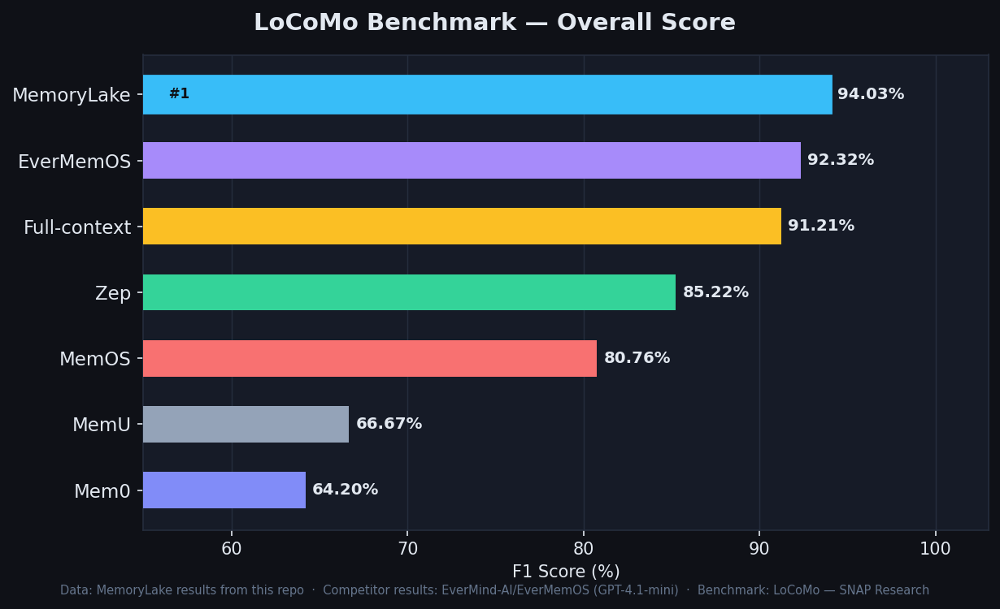
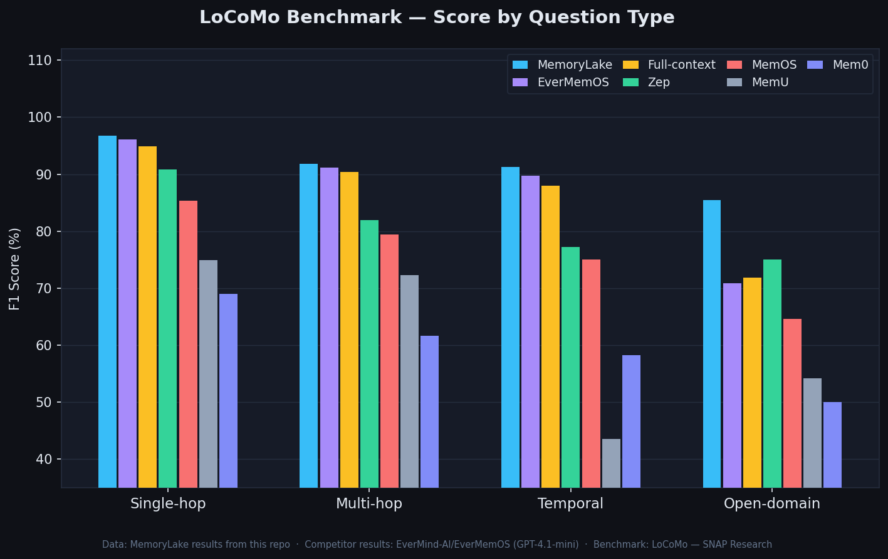
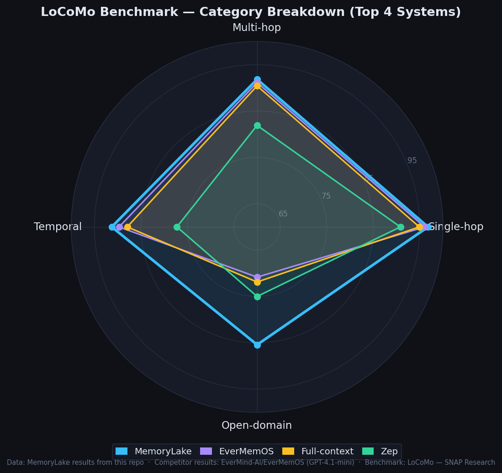
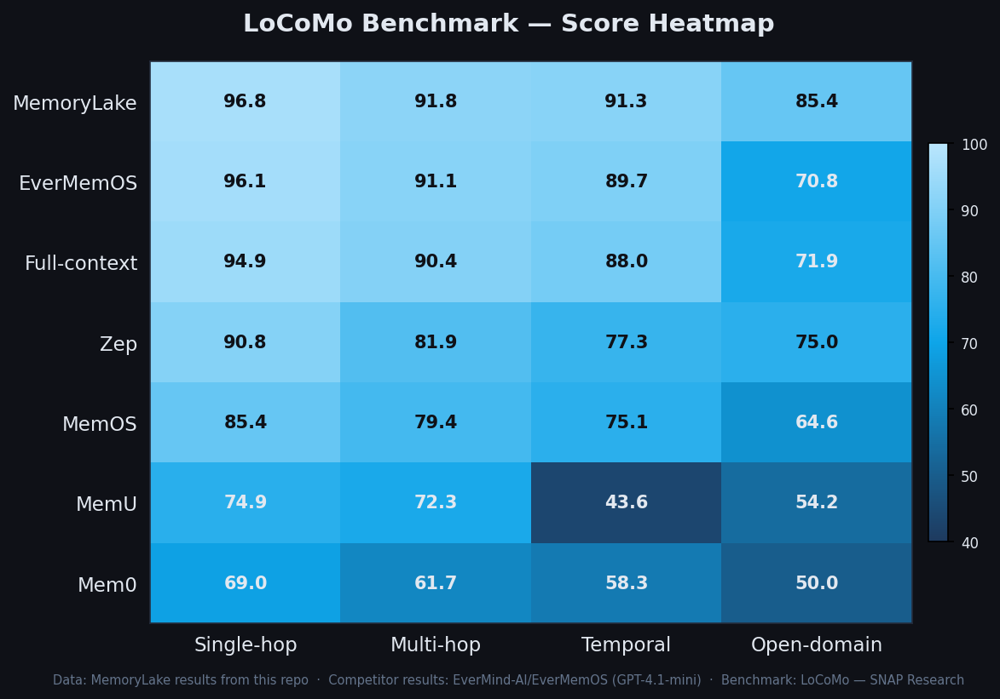
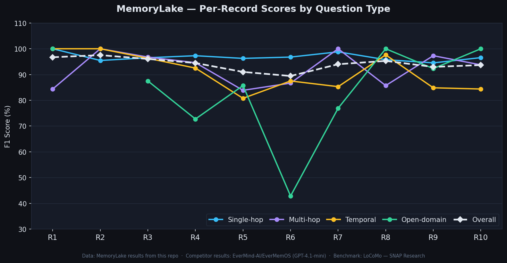

# LoCoMo Benchmark — MemoryLake

> Evaluating [MemoryLake](https://memorylake.ai/) on the **LoCoMo** long-term conversational memory benchmark.

---

## What is LoCoMo?

**LoCoMo** (Long-term Conversational Memory) is a rigorous benchmark created by [SNAP Research](https://snap-research.github.io/locomo/) to evaluate how well AI systems remember and reason over **very long conversations**.

Each conversation in LoCoMo spans:
- **~300 turns** across up to **35 sessions**
- **~9,000 tokens** on average
- Long time horizons where facts evolve across sessions

### Question Types

LoCoMo tests four distinct reasoning abilities:

| Type | Description |
|---|---|
| **Single-hop** | Direct factual recall — "When did Alice visit Paris?" |
| **Multi-hop** | Chained reasoning across multiple facts — requires connecting several pieces of information |
| **Temporal** | Time-aware reasoning — understanding when things happened, ordering events, duration |
| **Open-domain** | Broad world knowledge combined with conversation context |

These four categories reflect the real-world demands of a personal memory assistant: not just storing facts, but reasoning about them over time.

---

## What is MemoryLake?

[MemoryLake](https://memorylake.ai/) is an AI memory service that gives LLM applications long-term, persistent memory. It stores, retrieves, and reasons over historical context so that AI assistants can remember users across sessions.

---

## MemoryLake Results

Tested across **10 conversation records** from the LoCoMo dataset. Scores are F1 (%).

```
      record  single_hop   multi_hop    temporal open_domain     overall
------------------------------------------------------------------------
          R1      100.00       84.38      100.00      100.00       96.71
          R2       95.45      100.00      100.00         N/A       97.53
          R3       96.51       96.77       96.30       87.50       96.05
          R4       97.30       94.59       92.50       72.73       94.47
          R5       96.26       83.87       80.77       85.71       91.01
          R6       96.77       86.67       87.50       42.86       89.43
          R7       98.80      100.00       85.29       76.92       94.00
          R8       95.76       85.71       97.62      100.00       95.29
          R9       94.52       97.30       84.85       92.31       92.95
         R10       96.55       93.75       84.38      100.00       93.67
------------------------------------------------------------------------
         avg       96.79       91.84       91.28       85.42       94.03
```

---

## Comparison with Other Memory Systems

MemoryLake ranks **#1 overall** on the LoCoMo benchmark among all evaluated systems.

| System | Single-hop | Multi-hop | Temporal | Open-domain | **Overall** |
|---|---|---|---|---|---|
| **MemoryLake** 🥇 | **96.79%** | **91.84%** | **91.28%** | **85.42%** | **94.03%** |
| EverMemOS | 96.08% | 91.13% | 89.72% | 70.83% | 92.32% |
| Full-context | 94.93% | 90.43% | 87.95% | 71.88% | 91.21% |
| Zep | 90.84% | 81.91% | 77.26% | 75.00% | 85.22% |
| MemOS | 85.37% | 79.43% | 75.08% | 64.58% | 80.76% |
| MemU | 74.91% | 72.34% | 43.61% | 54.17% | 66.67% |
| Mem0 | 68.97% | 61.70% | 58.26% | 50.00% | 64.20% |

**Key highlights:**
- MemoryLake leads on every single question category
- MemoryLake's **temporal reasoning score (91.28%)** is 1.56 pp above EverMemOS and 3.33 pp above the full-context baseline — a category where most systems struggle
- MemoryLake's **open-domain score (85.42%)** is the highest by a wide margin (+10+ pp over the next best)
- MemoryLake outperforms even the full-context (no compression) baseline while using far less tokens

> **Competitor data source:** [EverMind-AI/EverMemOS evaluation](https://github.com/EverMind-AI/EverMemOS/tree/main/evaluation).
> All competitor systems used **GPT-4.1-mini** as the answer LLM to ensure fair comparison.

---

## Visualization

> Charts generated by [`plot_results.py`](./plot_results.py).

### Overall Score



### Score by Question Type



### Category Breakdown (Top 4 Systems)



### Score Heatmap



### MemoryLake — Per-Record Breakdown



---

## Data Sources

| Source | Link |
|---|---|
| LoCoMo benchmark | [snap-research.github.io/locomo](https://snap-research.github.io/locomo/) |
| Competitor results | [EverMind-AI/EverMemOS/evaluation](https://github.com/EverMind-AI/EverMemOS/tree/main/evaluation) |
| MemoryLake product | [memorylake.ai](https://memorylake.ai/) |

Raw per-question evaluation results are available in `locomo_result_*.json` files in this repository.
